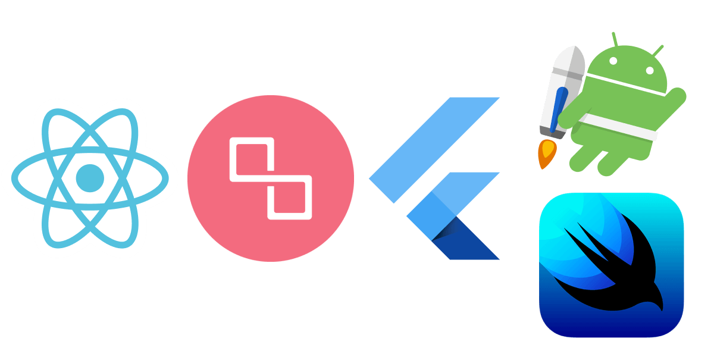
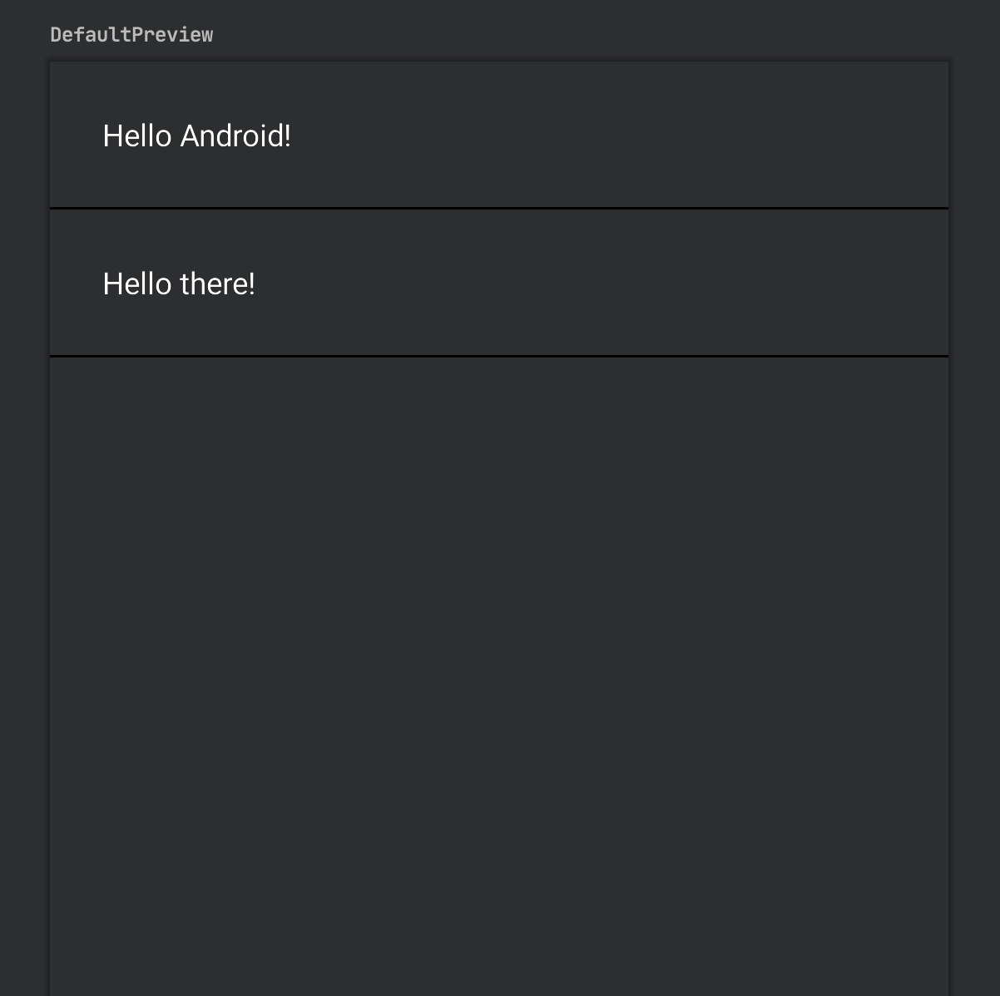
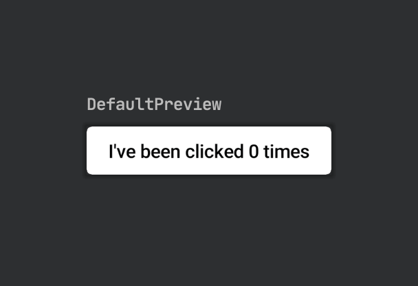

theme: Simple
footer: Jetpack Compose Workshop by PS Engineering
slidenumbers: true
text: #000000, alignment(left), Futura Next Light
slidenumber-style: #000000, alignment(right), Futura Next Light
code: Jetbrains Mono

# [fit] Jetpack
# [fit] Compose


[.background-color: #FE414D]

[.header: #FFFFFF, alignment(center), Futura Next]

[.hide-footer]

[.slidenumbers: false]

^B

---


^B

---

[.column]


Scott

[.column]


Michael

[.column]


Benjamin

^B

---



^ React ≥ Litho ≥ Flutter ≥ Compose / Swift UI

^B

---

> Jetpack Compose simplifie et permet d‘accélérer le développement des composants d’interface sur Android.
-- Android

^Scott

---

# Créer des composants de manière déclarative

<br>

[.column]


### Moins de code

[.column]


### Intuitif

[.column]


### Accélère le dév

[.column]


### Puissant

^Scott
`layout` & `class` vs `class`
UI as code -> màj du composant
100% interopérable ; aperçu temps réel
Accès API Android, nombreux composants déjà conçus : `Material Design`, `Thème sombre`, `Animations`

---

# Impératif

```kotlin
with(view) {
  background.setBackgroundColor(Color.RED)
  icon.setImageDrawable(myIcon)
  container.removeAllViews()
  container.addView(createMyViews())
}
```

^ how, évaluation immédiate

[.background-color: #2d2f30]

[.text: #FFF]

[.header: #FFF]

[.slidenumber-style: #FFF]

^M

---

# Déclaratif

```kotlin
val state = State(
  backgroungColor = Color.RED,
  icon = myIcon,
  children = [
  	viewStates()
  ]
)
view.render(state)
```

^ what, évaluation au changement (màj)

[.background-color: #2d2f30]

[.text: #FFF]

[.header: #FFF]

[.slidenumber-style: #FFF]

^M

---


# Hello 👋

```kotlin
@Composable
fun Greeting(name: String) {
  Text(text = "Hello $name!",
    modifier = Spacing(24.dp))
}

@Preview
@Composable
fun DefaultPreview() {
  Greeting(name = "World")
}
```


[.background-color: #2d2f30]

[.text: #FFF]

[.header: #FFF]

[.slidenumber-style: #FFF]

^M

---

# Layout 

```kotlin
@Composable
fun MyScreenContent() {
  Column {
    Greeting("Android")
    Divider(color = Color.Black)
    Greeting("there")
    Divider(color = Color.Black)
  }
}

@Preview
@Composable
fun DefaultPreview() {
  MyScreenContent()
}
```



[.background-color: #2d2f30]

[.text: #FFF]

[.header: #FFF]

[.slidenumber-style: #FFF]

^M

---

# État (extérieur)

```kotlin
@Model
class CounterState(var count: Int = 0)

@Composable
fun Counter(state: CounterState) {
  Button(text = "I’ve been clicked ${state.count} times",
    onClick = { state.count++ },
    style = ContainedButtonStyle(color = 
      if (state.count > 5) Color.Green 
      else Color.White))
}

@Preview
@Composable
fun DefaultPreview() {
  Counter(state = CounterState(0))
}
```



[.background-color: #2d2f30]

[.text: #FFF]

[.header: #FFF]

[.slidenumber-style: #FFF]

^M

--- 

# État (intérieur)

```kotlin
@Composable
fun Counter() {
  val count = +state { 0 }
  Button(text = "I've been clicked ${count.value} times",
    onClick = { count.value++ },
    style = ContainedButtonStyle(color = 
      if (count.value > 5) Color.Green else Color.White)
  )
}
```

^M

---

# Let‘s code<br>⌨️

1. Télécharger `Android Studio Canary` 
2. Cloner `xebia-france/mobile-things-jetpack-compose`
3. Commencez par [`step_0.md`](./steps/step_0.md)

Happy coding 🚀

^M